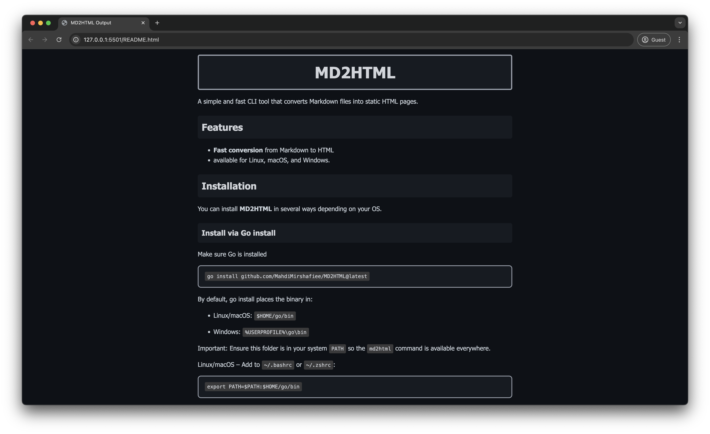

# MD2HTML
A simple and fast CLI tool that converts Markdown files into static HTML pages.

## Features

-  **Fast conversion** from Markdown to HTML
-  available for Linux, macOS, and Windows. 

## Installation
You can install **MD2HTML** in several ways depending on your OS.

### Install via Go install
Make sure Go is installed

```bash
go install github.com/MahdiMirshafiee/MD2HTML@latest
```
By default, go install places the binary in:

- Linux/macOS: `$HOME/go/bin`

- Windows: `%USERPROFILE%\go\bin`

Important: Ensure this folder is in your system `PATH` so the `md2html` command is available everywhere.

Linux/macOS – Add to `~/.bashrc` or `~/.zshrc`:
```bash
export PATH=$PATH:$HOME/go/bin
```
Then reload your shell:
```bash
source ~/.bashrc   # or source ~/.zshrc
```
Windows – Add `%USERPROFILE%\go\bin` to your Environment Variables → PATH.

### From Source
Make sure Go is installed

Unix / macOS:
```bash
# 1. clone
git clone https://github.com/MahdiMirshafiee/MD2HTML.git
cd md2html

# 2. prepare dependencies
go mod tidy

# 3. build local binary
go build -o md2html main.go

# 4. (Optional) Move to PATH
sudo mv md2html /usr/local/bin/
```

Windows (PowerShell):
```bash
git clone https://github.com/MahdiMirshafiee/MD2HTML.git
cd md2html
go mod tidy
go build -o md2html.exe main.go

# Move the file to a folder in PATH, e.g. C:\Windows\System32 or add its folder to PATH
```

Uninstall: remove the installed binary (e.g. `rm ~/go/bin/md2html`).
### Download prebuilt binary (GitHub Releases)
Best for non-Go users.

1. Go to the [Releases](https://github.com/MahdiMirshafiee/md2html/releases) page.
2. Download the binary for your OS & architecture.
3. 
4. Make it executable (Linux/macOS):

```bash
chmod +x md2html
```
5. (Optional) Move it to a folder in your PATH so it’s accessible everywhere:

```bash
# Linux / macOS
sudo mv md2html /usr/local/bin/md2html

# Windows: Place md2html.exe in a folder that's already in PATH, 
# or add its folder to the PATH environment variable.
```

## Usage

```bash
md2html <your-file.md>
```
## Example
```bash
md2html README.md
# Converted HTML saved as README.html
```
# 

## Contributing
Pull requests are welcome!
If you find a bug or want a new feature, feel free to open an issue or submit a PR.

## License
This project is licensed under the MIT License – see the [LICENSE](./LICENSE) file for details.